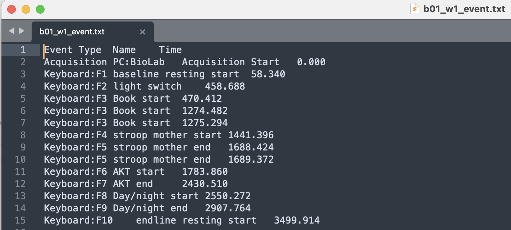
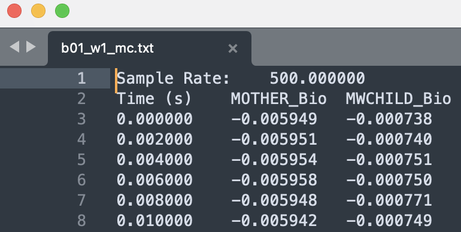
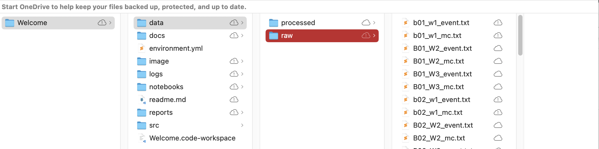
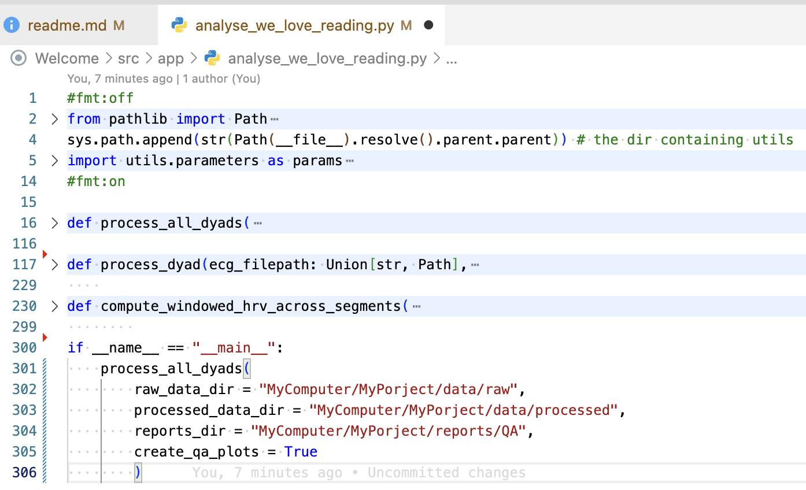
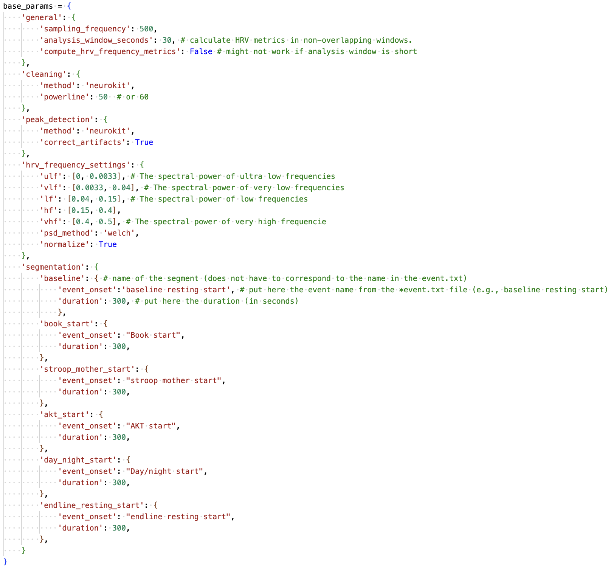

# ECG-HRV Data Processing Pipeline

## Description

This repository contains Python code to preprocess ECG data and to calculate HRV metrics from Mindware recording devices with event files. The code essentially combines preprocessing and analysis methods from the [Neurokit2 package](https://neuropsychology.github.io/NeuroKit/ "Link to documentation") with custom workflows used to segment and parameterize the data processing. For a complete overview of the preprocessing and analysis algorithms, the reader is strongly encouraged to throughly go through the [Neurokit2 documentation](https://neuropsychology.github.io/NeuroKit/).

Importantly, the code is primarly tailored towards processing and analysing the dyadic ECG recordings from the WeLoveReading (WLR) study. Nevertheless, the code is modular in nature and so can be adapted to be applicable to other study designs for as long as the Mindware recording device is used.

## Overview of the repository

- **environment.yml:** A text file that contains information about the python packages required to run the pipeline. A package manager such as [Anaconda](https://www.anaconda.com) can be used to create from this file a computing environment that is capable of running the ECG-HRV data processing pipeline.

The repository contains three important directories:

### ~/src/utils directory

- **common.py:** Functions and classes that will probably be used for any project such as code for logging, exporting files, and checking data types. It is unlikely that the existing code needs to be changed when adjusting the overal pipeline to a new experimental setup.
- **data_utils.py:** Contains functionality w.r.t. loading and preparing the input data (i.e., the mindware ECG and Event data) as well as segmenting the data. Since the (structure of) input data might change from one experiment to another (e.g., whether or not dyadic recordings, etc), it is very likely that existing functions need to be adjusted or complemented with new functions tailored to the experimental specifics.
- **parameters.py:** Contains the default parameters (called base_params) as well functions that can be used to change individual settings (e.g., segmentation and/or preprocessing settings) at the dyadic level (for the segmentation parameters) or the individual level (different preprocessing for mother and child).
- **plot_utils.py:** Contains functionality related to producing quality-control visualizations.
- **nk_pipeline.py:** Contains functionality related to the ECG preprocessing and HRV calculations. Most of the functions essentially wrap functionalities provided in the Neurokit2 package. Almost all functions take ECG data and parameters from parameters.py as input and generate either processed ECG data and/or HRV metrics.

### ~/src/app directory

- **analyse_we_love_reading.py:** Contains high-level function combine the functionality from common.py, data_utils.py, parameters.py, plot_utils.py, and nk_pipeline.py into easy-to-understand workflows to preprocess the ECG data and to calculate HRV metrics specifically tailored towards the We Love Reading study.

### ~/notebooks directory

- **ShowCasing the pipeline for WLR.ipynb:** A [Jupyter notebook](https://jupyter.org) with demonstrations on how the pipeline can be used to process the ECG data for the We Love Reading Study. Jupyter notebooks provide an interactive way to execute parts of python code and to inspect the underlying data. Moreover, Jupyter notebooks support Markdown so that code, documentation, and even visualizations can be combined in a single document.

  **>>>>Tip**: It is recommended to use [Microsoft Visual Studio Code ]()to work with Jupyter notebooks.
- It is possible to experiment with the pipeline code in a jupyter notebook and to even run the entire pipeline for all dyads in it. Just make a copy of the notebook that is already there and modify to your needs. At the very top of the notebook, you see that it imports functionalities from common.py, data_utils.py, nk_pipeline.py and so forth.

## How the pipeline works

As explained above, the pipeline is modular in nature: individual components need to be put together (and possibly adjusted) to adapt the pipeline to a specific experimental design. In this repository, the pipeline has been configured so that it can be readily applied to the We Love Reading Study.

### Configuration for the We Love Reading Study

By looking at either `~src/app/analyse_we_love_rading.py` or studying `~notebooks/ShowCasing the pipeline for WLR.ipynb` ShowCase 1, we can see that the pipeline does the following things:

**Required Inputs and Preparations:**

- All ECG recordings and event files need to be placed in a single folder; ideally in `~data/raw`
- Default parameters - optionally adjusted parameters for individual dyads - need to be configured in `~src/utils/parameters.py`

**Workflow:**

1. Looking in the directory `~data/raw` for all text files that end with *_mc.txt to define the ECG recordings and for all files that end with *event.txt to define the events. Output of this step is a list of filepaths for the ECG recordings and a list of filepaths for the events. Note that it is critically important that the file names are consistent since the dyad id, condition, and wave are extracted from the filename. Please have a look at the jupyter notebook and / or the Requirements section in this Readme for more information.
2. Using the filepaths from the previous step to (1) import an ECG recording and (2) the corresponding events. It also changes some column names and adjusts the formatting of the event files. Moreover, the ECG recording will be splitted into an ECG timeseries for the mother and an ECG timeseries for the child.
3. In the next step, the parameters for segmentation and preprocessing will be loaded. If adjustments have been made to the parameters in the file `~src/utils/parameters.py` by using either of the two functions in that file, the pipeline will use the subject/dyad ID inferred from the filename and adjust the parameters accordingly.
4. Based on the ECG signal, the event data and the parameters, the ECG signal of the mother and the child will be preprocesed. That is, data cleaning (i.e., filtering) and peak extraction.
5. The preprocessed signal and identified peaks are then segmented based on the segmentation parameters.
6. Next, the HRV metrics such as RMSSD are calculated for every, say 30, non-overlapping seconds of data per segment. The analysis window can be changed to any duration using the (base)parameters in `~src/utils/parameters.py`.

**Outputs:**

- `~data/processed/`: The location where the HRV metrics will be exported separetely for the mother and the child as Excel files. The segmented raw and cleaned, and identified peaks are exported as csv files. Finally, the parameters are exported separately for the mother and the child to allow for improved reproducibility.
- `~reports/`: Per segment, a quality control visualization will be saved that shows the raw data as well as the cleaned data with the identified peaks. Finally, the parameters are exported separately for the mother and the child.

### Customizing

While the overall workflow (data loading, parameter specification, preprocessing, segmentation, analysis, and export) will be the same, Some adjustments might be needed to make the pipeline run for different experiment settings. More information on that will be provided in the section Customizing the pipeline further down below in this document.

### How to quality control

While automatic data preprocessing and HRV analysis has its benefits in terms of speed and reproducibility, it has its disadvantages in terms of flexibility and, potentially, quality. Accurate peak detection is of critical importance for the calculation of HRV. Even one or two false positives / false negatives in a 30 seconds analysis window can increase or decrease the HRV by a factor of 2 or more. Quality control is therefore very important.

It is advised to use the pipeline in the following way:

1. Apply the pipeline to all recordings. Make sure to enable the export of quality-control visualizations.
2. Per participant / dyad, do the following:
   1. Go to `~reports/QA/` identify the participant / dyad and have a look at the visualizations to get an overall impression of the data quality and peak-detection performance.
   2. Go to `~data/processed` identify the participant / dyad and have a look at the HRV metric (e.g., RMSSD) and check for outliers across the analysis windows and / or segments. You can use the column analysis window / segment name in combination with the QA visualization to decide:
      1. If you want to flag the HRV value(s) as outliers and disregard them from further analyses
      2. If you want to use Mindware to manually clean the data and to have Mindware calculate the RMSSD value for that segment. In this case, make sure to use the same analysis window in Mindware. The RMSSD calculation should be the same.
      3. If you want to try different parameter settings for the mother and / or child using the functions provided in `src/utils/parameters.py`. Information about which parameter settings are available can be seen on the [Neurokit2 documentation](https://neuropsychology.github.io/NeuroKit/functions/ecg.html).

## Requirements

### Software requirements (recommended)

The software referenced below should be downloaded and installed. Both are entirely free.

- [Visual Studio Code](https://code.visualstudio.com): An advanced code editor that can be used to run code and to open Jupyter notebooks.
- [Anaconda](https://www.anaconda.com): A package manager to install program languages with all the requirements needed to execute code from a project such as this ECG-HRV Data Processing Pipeline

### Data requirements

**Timestamps in relative time; not absolute time**

It is critical that the timestamps in both the ECG recordings and the Event file is in relative time, starting at 0.00 seconds.

**Consistent filenames**

For the We Love Reading study, it is important that the data filename match the format below **exactly** (except it's not case-sensitive):

- `[condition][id]_W[wavenumber]_mc.txt` for the ECG recordings
- `[condition][id]_W[wavenumber]_event.txt` for the corresponding events

  where:
- `[condition]` is a single letter
- `[id]` is a number
- `[wavenumber]` is a number
- *Example*: B40_W3_mc.txt

**Consistent data schema**

- ECG recordings and Event files need to have their timestamp defined in relative time!

*Required schema of the Event file:*



*Required schema of the ECG recording:*



## How to Install

**Install the software**

1. Install [Visual Studio Code](https://code.visualstudio.com)
2. Install [Anaconda](https://www.anaconda.com)

**Create the python environment to execute the code**

It is advised to read the following brief documentation about what Anaconda is and how it is used: [https://anaconda.cloud/getting-started-with-conda-environments](https://anaconda.cloud/getting-started-with-conda-environments)

1. After having installed Anaconda, use the Windows Explorer / Mac Finder and navigate to the directory where the code of the ECG-HRV Data Processing Pipeline is located.
2. On Mac OS, right-**click on** the folder that contains all the code and select "Open terminal" from the context menu. On Windows, navigate **inside** the folder that contains all the code. Click on the the folder path at the top of the window, erase the path, and type instead "cmd". On Windows and Mac, a (black) command window / terminal should open.
3. To create the python environment, enter in the command window / terminal the following:

   ```
   conda env create --file environment.yml
   ```

   This command will instruct Anaconda to create a python environment using the specifications in the environment.yml file.
4. Follow the instructions in the terminal. If the command above results in error similar to "Cannot find conda" or "unknown command conda", then anaconda probably is not correctly installed. You can watch this Youtube Video that might help you getting it set up correctly: [https://www.geeksforgeeks.org/how-to-install-anaconda-on-windows/](https://www.geeksforgeeks.org/how-to-install-anaconda-on-windows/)
5. If everything went well, the new environment should be installed and ready for use. You can verify the installation by typing in the command window / terminal:

   ```
   conda env list
   ```

   It should show at least two environments. One called *base* and one called *neuroprofile*

## How to Use

### **Preparation**

* Open Visual Studio Code
* In Visual Studio Code, open the directory where the code of the ECG-HRV Data Processing Pipeline is located.
* Make sure that the raw ECG and Event data is stored in a single folder (see below) and not in subfolders.



### **Use the interactive Jupyter notebook to execute code**

Watch the following brief video that explains step-by-step how to work with Jupyter notebooks in Visual Studio Code. [https://code.visualstudio.com/docs/datascience/jupyter-notebooks](https://code.visualstudio.com/docs/datascience/jupyter-notebooks)

**Important**

Do not forget to select as Kernel / Python interpreter the virtual environment you have created before -called *neuroprofile*. Visual Studio code will then use this environment to execute the code in the jupyter notebook.

### Use a direct python command to execute the pipeline

Instead of using a jupyter notebook to execute the code, you can also directly run the code in `~src/app/analyse_we_love_reading.py` in one go by following the instructions below:

1. Open the terminal / command window in visual studio code by clicking on *view* in the top menu bar and then selecting *terminal.* In the bottom of pane, a terminal opens.
2. In the terminal, type:

   ```
   conda activate neuroprofile
   ```

   If that went well, you should see *neuroprofile* on the left side in the terminal.
3. Use the following command to execute the code in `~src/app/analyse_we_love_reading.py`

   *On Windows*

   ```
   python src\app\analyse_we_love_reading.py
   ```

   *On Mac OS*

   `python src/app/analyse_we_love_reading.py`

### Input and output parameters

If you execute the code directly, e.g., via `python src/app/analyse_we_love_reading.py`, then the default settings for the raw input data and where to store the processed data, HRV metrics, and quality-control visualizations will be used. 

By default:

- Input data is expected in `~data/raw`
- Preprocessed data and HRV metrics are exported to `~data/processed`
- Quality control visualizations are exported to `~reports/QA`. 

Output folders will be created if they do not exist.

If you want to change the parameters, just change them at the bottom of the file (see below):



!Mind the difference between Mac OS and Windows regarding the use of forward and backward slashes respectively!

## Configuring pipeline parameters

Some settings of the pipeline can be configured using a configuration provided in `~src/parameters.py.`
The default parameters for the application of the pipeline can be defined by using the base_params (see below). Unless not otherwise specified using the functions `configure_ecg_params()` and / or `configure_segmentation_params()`, the base_params are used for all dyads and individuals.



As you can see, the parameters are organized into different sections:

- For the sections *cleaning, peak_detection, and hrv_frequency_settings*, please refer to the [Neurokit2 documentation](https://neuropsychology.github.io/NeuroKit/functions/hrv.html) for the available options.
- In the *segmentation* section, you can add as many segmentations that as you are interested in and are available in the *event.txt file. Note that the name of the segments (e.g., baseline, book_start, akt_start) do not matter. The event_onset, however, must correspond to the exact name of the event as defined in the *event.txt. The duration of the event has to be given in seconds.

## Customizing the pipeline

When customizations are needed, those should be done at the lowest level. High-level work flows then need to be adapted as well.

- What really is different across studies might be the data.
  - `prepare_ecg_data()` needs to be modified
  - Some other functions might not be needed (e.g., `split_in_child_mother_series()`, `load_dyad_ecg_events()`, `extract_subject_id_condition_from_filepath()` ) and might need to be removed from higher-level workflows
- Parameters

## Limitations

Event offset = duration instead of dedicated stop event

## Notes

Parameters.segmentation.duration: mention that the duration needs to make sense (i.e., there will not be a check whether the duration of event_onset_e1 includes the onset of event_e2, for example).

ECG data and event date need to have timestamp in relative time (i.e., milliseconds starting at 0)
